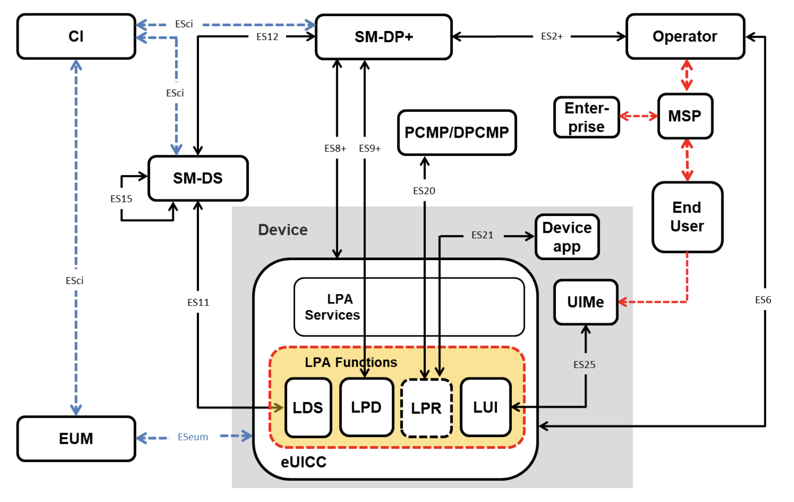
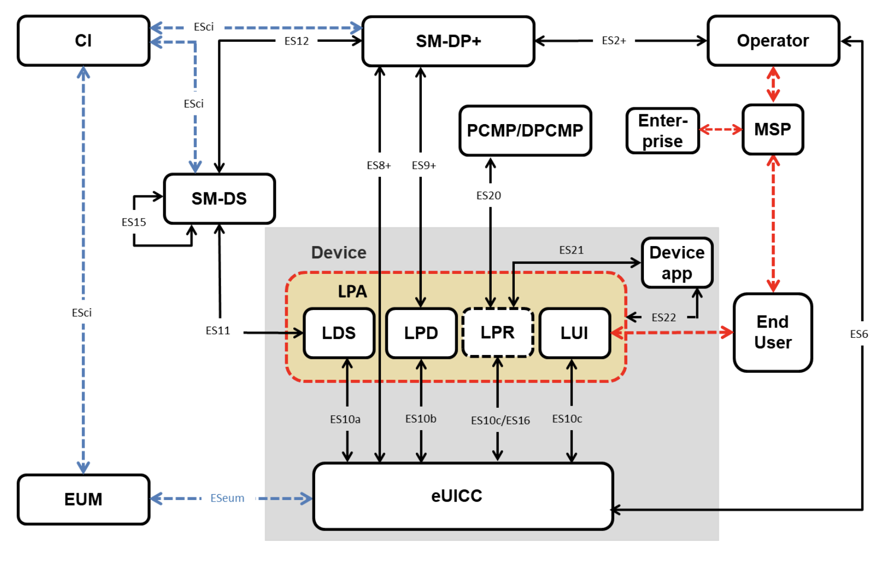
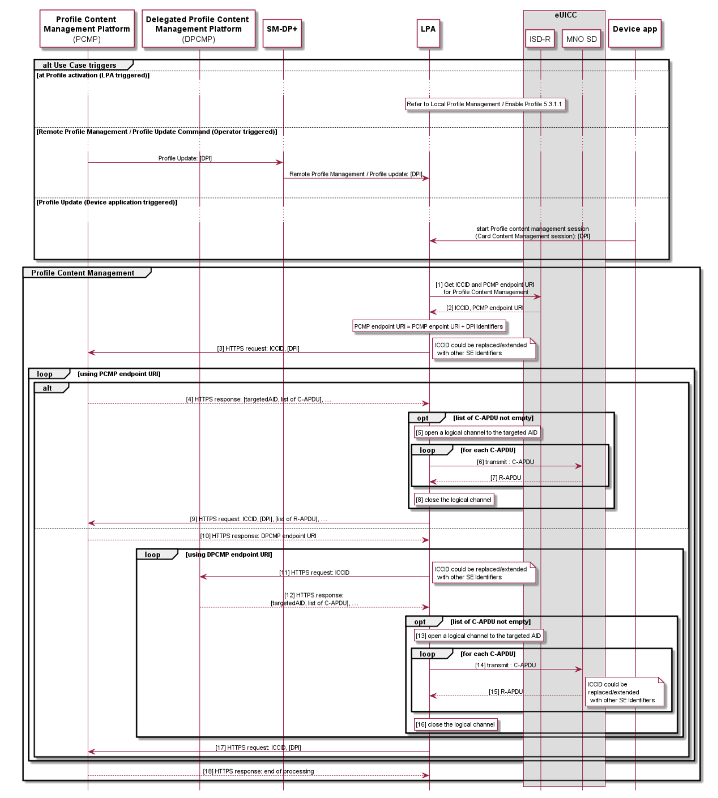
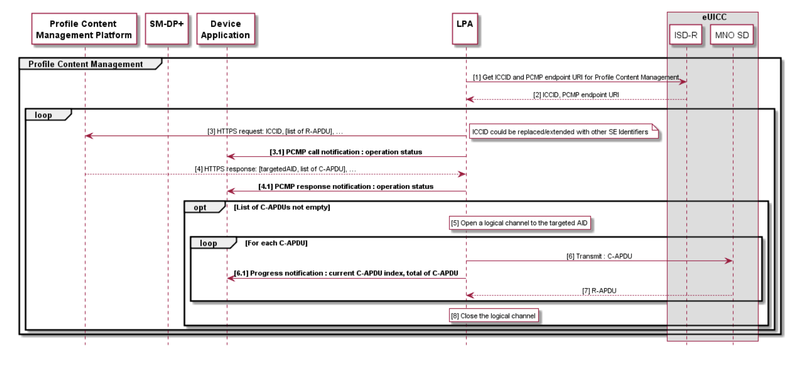

# Local Profile Assistant (LPA)

The Local Profile Assistant or LPA role exists both on Device (along with the LPA services provided by eUICC) and within eUICC with the LPA function provided by the eUICC. Although the eUICC cannot perform any of these functions independently without interacting with the Device, the extent of this interaction will vary based on the Device’s capabilities. The LPA provides four functions which are described below

| LPA Function Name | Description |
| --- | --- |
| Local Discovery Service (LDS) | As applicable, the LDS retrieves the pending Event Records from SM-DS for it’s associated eUICC. |
| Local Profile Download (LPD) | This is a proxy role to optimise a Bound Profile Package download by splitting it into two stages: i) the download of Bound Profile Package to LPD from SM-DP+ is done in a single transaction ii) the transfer of Profile to eUICC is then done in segments This function will depend on network, Device, and eUICC capabilities. |
| Local User Interface (LUI) | This function provides the End User an interface to perform Local Profile Management on Device. User Intent SHALL be enforced. |
| LPA P**R**oxy (LPR) | This plays a proxy role for the efficient management of Profile contents from a Profile Content Management Platform, or a Delegated Profile Content Management Platform. |

As per GSMA specification, deployment compatible LPAs need to meet certain criteria and requirements. These requirements can be referred below  
[LPA Requirements](./Requirements/LPA_Requirements.md) and [LDS Requirements](./Requirements/LDS_Requirements.md)

There are also some API requirements for LPA Access Control. There is also the provision for an APDU (Application Protocol Data Unit) access interface which MAY be provided by another Device component external to LPA. These APDU interfaces also need to satisfy some requirements. Reference for these requirements is below  
[LPA API Requirements](./Requirements/LPA_API_Requirements.md)

## Operational LPA Modes

When there is an LPA in both the Device and eUICC, then LPA to be used is specified by Device settings. The schematic for LPA in both modes is given below

LPA in the eUICC

LPA in the Device

# LPA PRoxy (LPR)

The LPR, or “LPA Proxy,” functions as a mediator between the Profile Content Management Platform owned by the Profile Owner and the Enabled Profile on the eUICC, aiming to enhance performance, similar to how the LPD operates between the SM-DP+ and the eUICC during Profile download.

Although the Profile Owner’s Content Management Platform is responsible for managing Profile content, it may redirect the LPR to a Delegated Profile Content Management Platform, allowing a third party to manage a portion of the Profile that has been delegated. This process applies in Simple Mode, Delegated Management, or Authorised Management.

The Device Application can trigger the LPR and may receive status updates regarding the exchanges between the Management Platform and the eUICC. LPA Proxy MAY be implemented partially outside the LPA.

> **LPA Proxy is OPTIONAL for Device, eUICC and SM-DP+ to support.**

[LPA PRoxy Requirements](./Requirements/LPR_Requirements.md) lists the requirements if LPA Proxy functionality is supported.

## LPR Procedures

The diagram below illustrates the expected behavior of the LPR and its role in end-to-end processes. It also emphasises the optional use of a Delegated Platform Identifier (DPI) during the trigger, which enables redirection to a Delegated Profile Content Management Platform. The supported management modes SHALL include Simple Mode, Delegated Management, and Authorised Management.

There are three methods by which a connection request from the LPA to the Profile Content Management Platform may be triggered:

- Automatic triggering after a Profile is enabled (this option is configured within the Profile to be activated or not)
- An RPM command sent from the SM-DP+ to the LPA
- Specific API command issued from a Device Application to the LPA

LPA Proxy Procedure

**Start Conditions:**

- When a Profile that requests the automatic triggering of the LPR procedure is enabled, an optional DPI parameter may be included to indicate an expected connection to a Delegated Profile Content Management Platform (PCMP).
**OR**
- When an RPM Profile update command triggering the LPR procedure is received from the SM-DP+, an optional DPI parameter may be included to indicate an expected connection to a Delegated PCMP.
**OR**
- When a specific API command is sent from a Device Application to the LPA to trigger the LPR procedure and start a Profile content management session (Card Content Management Session), an optional DPI parameter may be included to indicate an expected connection to a Delegated PCMP.

**Procedure:**

1. The LPR requests the ICCID and the PCMP endpoint URI associated to the
Profile Content Management Platform from the eUICC.
2. The eUICC sends the ICCID of the Enabled Profile and the PCMP address to the
LPR.
3. The LPR connects to the PCMP, with the DPI as a parameter if provided during
the initialisation of the LPR Procedure. This step is followed by step 4 (sending
the lists of C-APDU from the PCMP) or 10 (sending the URI of a Delegated
PCMP) or 18 (end of processing).  
***Note: Steps 4 to 9 MAY be skipped if the PCMP requests a redirection to the DPCMP***
4. The PCMP provides a list of Command APDUs (C-APDUs) and the AID of the
targeted application of the Enabled Profile.
5. The LPR opens a logical channel to the AID of the targeted application of the
Enabled Profile.
6. The LPR transmits the list of C-APDUs to the targeted application of the Enabled
Profile within the MNO-SD.
7. The targeted application sends back the list of Response APDU (R-APDU) to the
LPR.
8. The LPR closes the logical channel.
9. The LPR sends the list of R-APDUs to the PCMP, and in addition, the DPI
parameter if provided during the LPR procedure initialisation request.
Additionally, this step is equivalent to step 3: the LPR connects to the PCMP,
with the DPI as a parameter, if provided during the initialisation of the LPR
procedure.
This step is followed by step 4 (sending a new list of C-APDUs from the PCMP)
or 10 (sending the URI of a Delegated PCMP) or 18 (end of processing).  
***Note: Steps 10 to 17 MAY be skipped if the DPI parameter is not provided during the LPR
procedure initialisation request.***
10. The PCMP provides the address of the DPCMP to the LPR to initialise the
redirection.
11. The LPR connects to the DPCMP address.
12. The DPCMP provides a list of Command APDUs (C-APDUs) and the AID of the
targeted application of the Enabled Profile.
13. The LPR opens a logical channel to the AID of the targeted application of the
Enabled Profile.
14. The LPR transmits the list of C-APDUs to the targeted application of the Enabled
Profile within the MNO-SD
15. The targeted application sends back the list of Response APDUs (R-APDUs) to
the LPR.
16. The LPR closes the logical channel,
17. This step is equivalent to step 3: The LPR connects to the PCMP, with the DPI
as a parameter if provided during the initialisation of the LPR Procedure.
This step is followed by step 4 (sending the lists of C-APDU from the PCMP) or
10 (sending the URI of a Delegated PCMP) or 18 (end of processing).
Note: Step 18 is used by the PCMP to end the processing
18. The PCMP sends an acknowledgement to the LPR about the end of processing.

When initialising the connection between the LPR and the PCMP or the DPCMP, a
HTTPs session SHALL be established between the LPR and respectively the PCMP and
DPCMP based on a public key of the Root Certificate stored in the Device which
includes authentication using the TLS Certificate, and may check for the presence of the
adequate platform identifier in the TLS Certificate used for the TLS session.

**End Condition:**

- The Profile content has been updated as per the updates received from PCMP or DPCMP or both.

## Device Application Interaction with LPR

LPA Proxy can also use Notifications to interact with specific Device Applications. These notifications can be used to inform End User of update progress of Profile Management session.

Device Application Interaction with LPA Proxy

**Start Conditions:**

- When any one of the triggers for connection between PCMP and eUICC has been initiated.
- A Device Application is registered to receive notifications during Profile Content Management session.

**Procedure:**

1. The LPR requests the ICCID and the (D)PCMP endpoint URI associated to the
Profile Content Management Platform from the eUICC.
2. The eUICC sends the ICCID of the Enabled Profile and the (D)PCMP address to
the LPR.
3. The LPR connects to the (D)PCMP.
    1. The LPR sends a Notification about the operation status to the registered Device
    Application.
4. The (D)PCMP provides a list of Command APDUs (C-APDUs) and the AID of the
targeted application of the Enabled Profile.
4.1 The LPR sends a Notification about the operation status to the registered Device
Application
5. The LPR opens a logical channel to the AID of the targeted application of the
Enabled Profile.
6. The LPR transmits the list of C-APDUs to the targeted application of the Enabled
Profile within the MNO-SD.
    1. The LPR sends a Notification about the operation status to the registered Device
    Application
7. The targeted application sends back the list of Response APDU (R-APDU) to the
LPR.
8. The LPR closes the logical channel.

**End Condition:**

The application of the Enabled Profile has been updated according to updates received from the (D)PCMP. The Device Application has been notified during the procedure execution.
