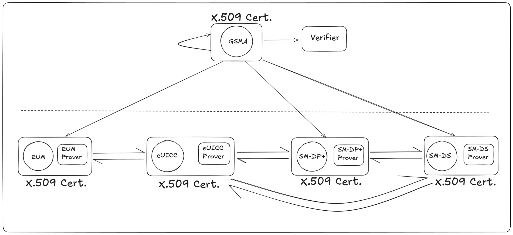

## Remote SIM Provisioning
>
>Remote SIM provisioning is a specification realized by GSMA that allows consumers to remotely activate the subscriber identity module (SIM) embedded in a portable device such as a smart phone, smart watch, fitness band or tablet computer. The specification was originally part of the GSMA's work on eSIM and it is important to note that remote SIM provisioning is just one of the aspects that this eSIM specification includes.

#### GSMA
>
>The GSM Association (commonly referred to as 'the GSMA' or Global System for Mobile Communications, originally Groupe Spécial Mobile) is a non-profit industry organisation that represents the interests of mobile network operators worldwide. More than 750 mobile operators are full GSMA members and a further 400 companies in the broader mobile ecosystem are associate members.

---

### Structure
The SIM is now structured into "**domains**" that separate the operator profile from the security and application "**domains**".  

**The concept of "domains" is a structural approach to segregate the functionalities and responsibilities within the SIM.** 
>
>In practise "eSIM upgrade" in the form of a normal SIM card is possible (using the Android 9 eSIM APIs) or eSIM can be included into an SOC.
>The requirement of GSMA certification is that personalisation packet is decoded inside the chip and so there is no way to dump Ki, OPc and 5G keys.
>Another important aspect is that the eSIM is owned by the enterprise[clarification needed]!,
>and this means that the enterprise now has full control of the security and applications in the eSIM, and which operators profiles are to be used.
---
## Domains in eSIM
#### 1. Operator Profile Domain
- This domain holds the traditional functionalities of a SIM, primarily related to network access. It contains information such as:
  - **International Mobile Subscriber Identity (IMSI)**: The unique identifier for the subscriber on the mobile network.
  - **Authentication Keys**: Used to authenticate the subscriber on the network and establish a secure connection.
  - **Network-Specific Configurations**: Settings required by the Mobile Network Operator (MNO), such as preferred access technologies and roaming rules.
- The **operator profile domain** is controlled and managed by the MNO. This domain ensures that the eSIM can establish and maintain connectivity with the mobile network.

#### 2. Security Domain
- The **security domain** is a dedicated area within the eSIM that manages sensitive cryptographic operations. This domain is responsible for:
  - **eKYC (Electronic Know Your Customer)**: Ensures compliance with regulations like GDPR, AML, and AFT by verifying the identity of the subscriber.
  - **Secure Key Storage**: Safeguards cryptographic keys, protecting them from unauthorized access.
  - **Over-The-Air (OTA) Updates**: Enables the secure provisioning of new keys, certificates, or updates to the eSIM.
  - **Secure Element**: A hardware-based security module that manages cryptographic operations, isolated from other domains to prevent unauthorized access.

This domain-based architecture adds a layer of abstraction and security, allowing eSIMs to serve it purpose ensuring compliance with security and regulatory requirements.

### Operations

### X.509 Certificates and Chain of Trust
The Chain of Trust in X.509 certificates is a hierarchical structure used to verify the authenticity of digital certificates.  
It begins with a Root Certificate Authority (Root CA), which is inherently trusted and widely distributed in systems and browsers.  
The Root CA issues and signs certificates for Intermediate Certificate Authorities (Intermediate CAs), which in turn issue certificates to End-Entities (Leaf Certificates), such as websites or users.  
To establish trust, each certificate in the chain must be verified by the certificate above it, with the process starting from the end-entity’s certificate and moving up to the intermediate and root certificates. If any part of this chain is invalid, revoked, or tampered with, the entire chain is considered untrusted, which compromises the security of the system. Read more about Chain of Trust [here](./CI/Readme.md)

## Problem
_The problem with current RSP lies in trust, security, transparency, and automation in the process of remote SIM provisioning (RSP), which could potentially be solved using smart contracts and modern cryptography._

### The challenges:
1. **Trust Between Service Providers and Consumers**: Consumers must trust the remote provisioning process carried out by mobile operators or third-party service providers to be secure and private. Currently, this process requires reliance on intermediaries (like Subscription Managers) to manage SIM profiles and switch between mobile operators. This raises concerns about data security, privacy, and the handling of SIM profiles.

2. **Complexity in Profile Management**: Managing multiple profiles, especially when different service providers are involved, can be cumbersome. The current system involves centralized entities, making it prone to inefficiencies or even misuse of consumer data.

3. **Manual Processes and Delays**: Even though remote provisioning allows flexibility, manual intervention is still required at various stages (like authentication, profile switching, and payment settlement). This introduces potential delays and human errors.

4. **Unnecessary TLS Encapulation**: The security of RSP depends unnecessarily on it being encapsulated in a TLS tunnel, Interfaces within RSP over TLS are prone to passive adversaries.

### The main ssue with current [RSP](https://en.wikipedia.org/wiki/Remote_SIM_provisioning)
>
>The current RSP standard that remotely provision eSIM to user devie is based on a mechanism which revolves around exchanging keys and signing certificates between the device and the mobile network operator (MNO). These keys and certificates are used to verify the authenticity of the device and establish a secure and encrypted connection.
>And the security relies on trusted parties (central authority), The device manufacturers here play a crucial role along with OS to make sure not reveal eSIM profile.
>This also makes the environment restricted and later a closed industry.
>>

### Resolved Issue
*With the [open source eSIM Smart Wallet](https://github.com/Blockchain-Powered-eSIM/smart-contract-suite) we have resolved the issue that gets introduced in the eSIM stack based on current RSP which is*
>
>The right of independent service providers to transmit commands of loading profiles to SIM-cards in the device has been amended and the possibility to store arrays of profiles in independent certified data centres (Subscriptions manager) has appeared.
>

#### Where eSIM Smart Wallet allows users to own their profiles and remove the requirements to store profiles in data centres.
---

# RSP Architecture:
**NOTICE**: All the traditonal knowledge and new RnD is started from [RSP Architecture SGP.21 V3.1](https://www.gsma.com/solutions-and-impact/technologies/esim/wp-content/uploads/2023/12/SGP.21-V3.1.pdf). The interaction between components and inner working is represented by `ES`.

The current Remote SIM Provisioning Architecture,

### Major Componenets:

- Certificate Issuer(CI)
- Operator
- Mobile Service Provider
- SM-DP+ (Data Preparation)
- SM-DS (Discovery Service)
- LPA (Device App)
- eUICC (embedded chip)

### Principles

All parties either implementing or operating systems based on these specifications should be aware that any data items passed between system elements that can be used to identify an individual can be classified as personal data (as defined in the General Data Protection Regulation (EU) 2016/679). Responsibility for the management of Personal Data and compliance with any necessary legislation lies with implementing and operating organisations, according to each organisation’s respective legal status with respect to the data processes (i.e. whether the entity acts as a data controller or as a data processor).

### High Level Authorized Parties
>The requirement of GSMA certification is that personalisation packet is decoded inside the chip and so there is **no way to dump Ki, OPc and 5G keys.**
>Another important aspect is that the **eSIM is owned by the enterprise**, and this means that the enterprise now has full control of the security and applications in the eSIM, and which operators profiles are to be used.

- root GSMA CI
- sub CI
- EUM
- OEM
- Operator

# Open Source Remote SIM Provisioning (OpenRSP)
>
>OpenRSP, an Open Source [Remote SIM Provisioning](https://github.com/Blockchain-Powered-eSIM/eSIM-Wallet/wiki/Remote-SIM-Provisioning) protocol, for modern digital world, where everyone around the globe are connected(more connecting everyday) with telecom and data networks.
>The core of all the network protocols is cryptography, provides solutions to big domain of problems from privacy to security, integrity to authenticity and thus is the core of the modern digital world we all live in.
>The infrastructure supporting global connectivity relies on highly secure, proven cryptographic protocols that protect data and communication across diverse networks. Using mobile device , everyone is connected and rely on telecom network in all circumstances.
>To maintain user/consumer/everyone's data privacy, integrity, authencticity and security openRSP leverage modern cryptography and communication prootocols and with Smart Contracts it introduces ownership which hasn't been really looked into the telco industry on the cosumer side.
>With modern tech, secure-by-design and open source principle , OpenRSP delivers a trustless system in telecom industry which allows consumers to do more than just communicate.

## Abstract

OpenRSP, an Open Source Remote SIM Provisioning protocol, represents a new era in mobile connectivity, addressing the limitations of traditional systems while ensuring robust security, privacy, and user ownership. As the world becomes increasingly connected through telecom and data networks, the reliance on secure communication protocols is paramount. Cryptography plays a vital role in solving fundamental issues related to privacy, security, integrity, and authenticity, which form the foundation of modern digital infrastructure. As a protocol, RSP is continuosly evolvolving and it'll be the same until consumers have full ownership. Current RSP standards are dependent on central authority for trust, where device manufacturers and mobile network operators (MNOs) control the provisioning of eSIM profiles and by-design the ownership of consumer eSIM profile is held by Operators. Security is derived by exchange of keys and certificates between devices and MNOs, leading to a restricted and closed environment that lacks transparency and user empowerment. Authentications within the server reveals sensitive information and complexity can be improved by improving the design.
OpenRSP leverages modern cryptographic protocols and integrates smart contract technology to introduce a trustless system, removing reliance on traditional trusted parties. By decentralizing the control over eSIM profiles and allowing consumers to own and manage their profiles independently, OpenRSP empowers users in ways previously unexplored in the telecom industry. This innovative approach not only enhances security but also promotes greater transparency and consumer rights.
Through the use of the open source eSIM Smart Wallet, OpenRSP resolves key issues inherent in the current RSP stack. It removes the need for profiles to be stored in centralized data centers and enables independent service providers to load profiles directly onto devices. This shift enhances user control, ensuring that consumers have full ownership of their digital identity and profiles.
Built on the principles of secure-by-design, OpenRSP establishes a decentralized, transparent, and user-centric approach to mobile provisioning. It redefines how we view connectivity, empowering users to do more than just communicate while fostering a more open and secure telecom ecosystem.

## Zero Knowledge Proving System (ZKPs)
Zero Knowledge Proofs and Proving Systems is a groundbreaking tool to achieve goals for modern digital world.
In the world of sharing, exposure or leakage of information, ZKP provides a protocol where prover share nothing but the proof that he holds the right information to follow the respective protocol and verifier verifies accordignly.

- **Can you prove you followed the process without revealing the underlying details?**
- **Can you prove an outcome is valid without disclosing the steps that led to it?**
- **Can you verify a claim without revealing anything beyond the claim itself?**

of-course you need to define what it means not to reveal anything else.

**These question leads to the birth of first Zero Knowledge Proof(by a different name).**

### Using ZKP in RSP

1. Certificate Authentication without Revealing the Certificate Contents
2. ZKP for EID Privacy (_if this is only the motive and system entity's aren't dependent, then just hiding EID using another primitive would be better choice, perhaps_)
3. ZK SM-DP+ Authentication
4. ZK Secure TLS Communication
6. ZK Chain of Trust Validation
6. ZKProofs for Revocation Checking

## Directions for advancements in privacy of RSP as a protocol

### Trust Distribution, same certficates

While the GSMA holds the authority to issue the X.509 certificates, and the intermediate CAs issue it to the intermediates/end-entity below them in hierarchy, the end-entities need to Trust the Proof chain and they are pretty much clueless about the authenticity of the X.509 certificates held by their "higher-ups" in the chain until each certificate has been verified every time. These certificates act as the proof of authority of the CA and, the X.509 certificate itself is shared between the various entites participating in the RSP and these certificates contain various private/sensitive data.  
The solution aims to remove the trust from the GSMA CI to the ZKP Verifier (which verifies the authenticity of the X.509 certificate and the verifier is publicly available on-chain ready to be verified by anyone) and each entity creates their own ZKP proof for their certificate. This allows the protocol to authenticate the participants without revealing their X.509 certificates, or any sensitive data in the certificates.  
A central registry will record the proofs on-chain and these proofs might be used to prove the authenticity of an existing certificate (until a certain time perios) without having the need to generate a new proof for every interaction happening between the same set of entities in a given span of time.  
> The idea is still under development and there might be significant changes in future.

### More Privacy, no certificates (vague)

It includes modern authentication for eSIMs, ensuring their validity and enabling users to prove ownership of eSIM profiles to network providers without compromising their private credentials. One key aspect of our approach is the utilization of the eUICC unique identifier (EID) to create a Secure Identifier (SSID/ZKID/DID). The EID is inherently unique and tied to the device's hardware, serving as a robust form of two-factor security. By combining this hardware-backed identifier with “*something you know*" (e.g., user credentials) and "*something you are*" (e.g., biometric data), we can enhance privacy-focused encryption and authentication for outsourced data and industry-wide collaboration. Thinking about OpenRSP incorporating the secure identifier, an advanced framework that leverages state-of-the-art cryptographic techniques to address these challenges.

OpenRSP can incorporate two key innovations, Identity-Based Non-Interactive Key Exchange (IBNIKE) for Secure Identifier (SSID/ZKID) generation and Multi-Party Oblivious Transfers (MPOT) using Garbled Circuits for secure interactions within the RSP ecosystem. IBNIKE enables the generation of unique, privacy-preserving identifiers for end users without compromising their personal data. MPOT ensures secure collaboration between multiple entities involved in eSIM provisioning, safeguarding user privacy and system integrity.

OpenRSP represents a significant advancement in eSIM provisioning technology, offering a secure and privacy-preserving solution that meets the evolving needs of mobile network operators, device manufacturers, and end users. This draft will continue to improve and serve as a comprehensive guide for stakeholders interested in adopting OpenRSP to enhance the security and privacy of their eSIM ecosystems.

---
We will be providing a detailed analysis of the theory, implementation, challenges and potential benefits of incorporating these advanced cryptographic techniques into eSIM technology.
Our result will demonstrate that the proposed framework not only significantly improves the security and privacy of the RSP process but also lays the foundation for a more trustworthy and collaborative environment in the digital communication domain.

Work in progress . . .
