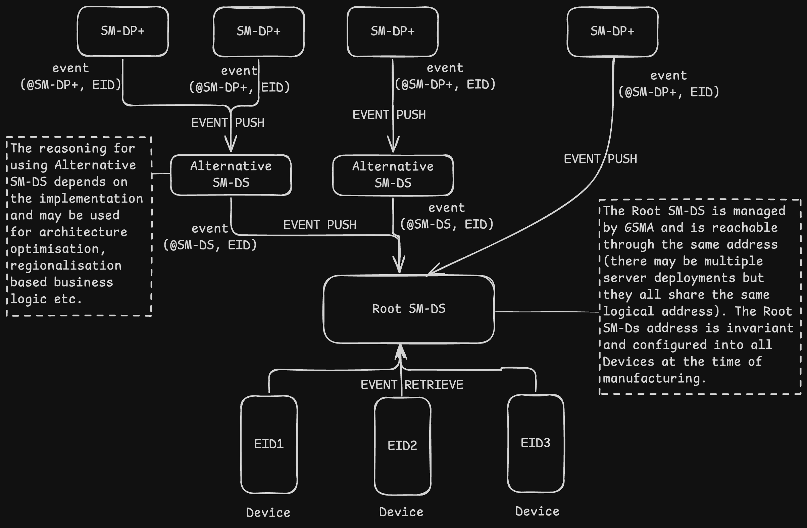
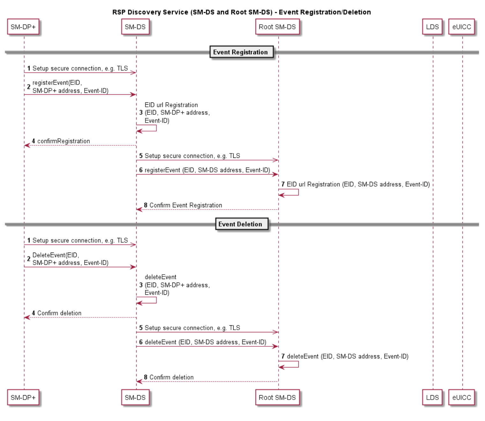
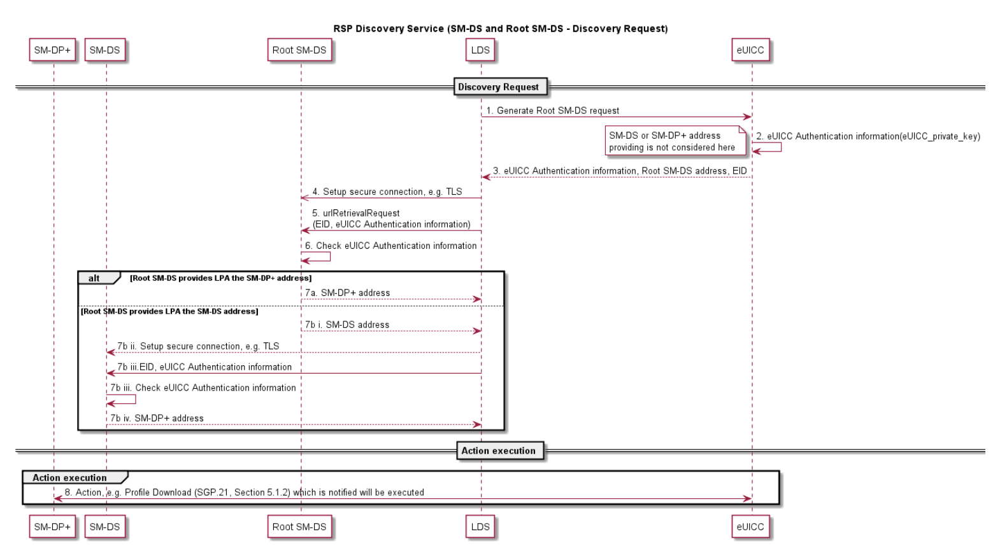

# Subscription Manager – Discovery Service (SM-DS)

## Overview
The role of the SM-DS is to,  
- Provide mechanisms that allow an SM-DP+ to inform the LDS within any Device that an SM-DP+ wishes to communicate with it.
- The purpose of the SMDS to LDS communication SHALL be informing the LDS of a pending Event.

The principle of operation remains the same for all use cases,  
_**The SM-DP+ will send an Event Registration message for a target Device to an SM-DS.**_  

In a simple deployment, only the Root SM-DS is configured on the eUICC.
- The Root SM-DS address is unique and filled in the eUICC.
- The LDS in the target Device polls the Root SM-DS using the same logical location.
- When the Root SM-DS has an Event-ID for the target Device it will respond with the SM-DP+ address, or
- If there is no Event-ID the response will be a null response.

In a deployment with cascaded SM-DSs, the SM-DP+ will send an Event Registration to an,
- Alternative SM-DS, which may not be configured as the Root SM-DS on the eUICC.
- This alternative SM-DS will cascade the Event Registration to the Root SM-DS.
- The LDS in the target Device polls the Root SM-DS and will receive the Alternative SM-DS address.
- It will then request the Event from the Alternative SM-DS, which will respond with the SM-DP+ address.

## Implementation
Two configurations of the SM-DS MAY exist:
 - A Root SM-DS
 - An Alternative SM-DS

> **The Root SM-DS is configured at the time of Device manufacture and is invariant.**

  
SM-DS Implementation

## Implementation Guidelines:
The following statements SHOULD be considered when defining a technical implementation:
- A competitive environment on the supply of SM-DS services SHOULD be favoured by the approach.
- There SHOULD be no single-points-of-failure.
- Implementation SHOULD inherently provide both vertical and horizontal performance/scalability.
- There SHOULD be no need for pre-registration of Devices or eUICCs at a certain SM-DS.

## Functions
The SM-DS supports mainly four functions which are described as

| Function Name | Description |
| --- | --- |
| Event Registration | This function allows SM-DS to store an Event Record received from an SM-DP+ server. |
| Event Deletion | This function allows an SM-DP+ to delete it’s own Event Record registered in the SM-DS server. |
| Event Checking | This function provides the presence of any Event Records upon an Event Checking request from any enquiring LDS. |
| Event Retrieval | This function provides all registered Event Records for any LDS sending a Discovery Request |

### Event Registration Procedure  

The procedure steps for Event Registration/Deletion in the figure below  
  
SM-DS Event Registration and Deletion Procedure

**Starting Condition:**   
a. The SM-DP+ has an Event Registration action waiting for a target eUICC identified by the EID.  

#### Procedure: 
1. The SM-DP+ sets up a secure connection to an Alternative/Root SM-DS server as per configured by Profile Owner.
2. After the connection is set up the SM-DP+ sends a notification the the alternative SM-DS about Event Registration action.
3. The SM-DS registers the event as per the details sent by SM-DP+.
4. SM-DS sends a confirmation to requesting SM-DP+.
5. (Only needed if an Alternative SM-DS was used in Step 2) The Alternative SM-DS sets up a secure connection to the Root SM-DS.
6. The event is forwarded by Alternative SM-DS to the Root SM-DS as recorded.
7. The Root SM-DS registers the event as received.
8. Root SM-DS confirms the Event Registration to Alternative SM-DS.

### Event Deletion Procedure:

**Starting Condition**  
a. The SM-DP+ has an Event Deletion action waiting for a target eUICC identified by the EID.

#### Procedure: 
1. The SM-DP+ sets up a secure connection to an Alternative/Root SM-DS server as per configured by Profile Owner.
2. After the connection is set up the SM-DP+ sends a notification the the alternative SM-DS about Event Deletion action.
3. The SM-DS deletes the event as per the details sent by SM-DP+.
4. SM-DS sends a confirmation to requesting SM-DP+.
5. (Only needed if an Alternative SM-DS was used in Step 2) The Alternative SM-DS sets up a secure connection to the Root SM-DS.
6. The Alternative SM-DS notifies Root SM-DS that an Event Record was deleted for the given EID.
7. The Root SM-DS deletes the Event Record.
8. Root SM-DS confirms the Event Deletion to Alternative SM-DS.

## Discovery Request Procedure  
The procedure for a deployment with an Alternative SM-DS and the Root SM-DS (cascade mode).
  
SM-DS Event Registration Procedure

### Procedure:  
1. The LDS requests eUICC to generate authentication information in order to initiate a Root SM-DS discovery request.
2. The eUICC, using it’s private key and other credentials generates the authentication information requested by LDS, which contains (at least) the eUICC-Certificate signed by the eUICC.
3. Authentication information is sent from eUICC to the LDS along with the Root SM-DS address.
4. LDS establishes a secure connection to the Root SM-DS address provided.
5. LDS requests the Root SM-DS for retrieval of pending Event Records for target eUICC.
6. The Root SM-DS verifies eUICC authentication information received from LDS.
7. IF eUICC authentication information checks out and pending Event Records are found, the Root SM-DS responds with:
    1. The SM-DP+ address where the Event action is pending
    or (in case of an Alternative SM-DS)
    2. These actions follow:
        1. Alternative SM-DS address where Event Records are registered.
        2. LDS establishes a secure connection with Alternative SM-DS address provided.
        3. Alternative SM-DS verifies eUICC authentication information received
        4. If eUICC is authentic and there are pending Event Records, Alternative SM-DS responds back with SM-DP+ address where the actions are pending.
8. LPA establishes a secure connection to SM-DP+ address provided and the pending action can be executed.
